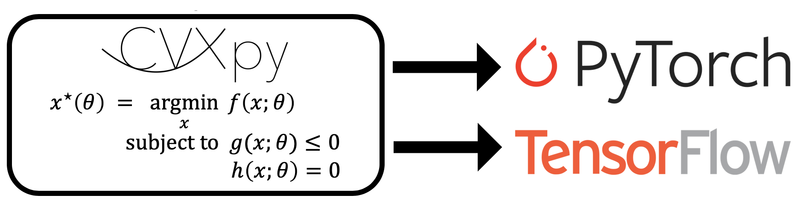

[](https://travis-ci.org/cvxgrp/cvxpylayers)

# cvxpylayers

cvxpylayers is a Python library for constructing differentiable convex
optimization layers in PyTorch and TensorFlow using CVXPY.
A convex optimization layer solves a parametrized convex optimization problem
in the forward pass to produce a solution.
It computes the derivative of the solution with respect to
the parameters in the backward pass.

This library accompanies our [NeurIPS 2019 paper](http://web.stanford.edu/~boyd/papers/pdf/diff_cvxpy.pdf)
on differentiable convex optimization layers.
For an informal introduction to convex optimization layers, see our
[blog post](https://locuslab.github.io/2019-10-28-cvxpylayers/).

Our package uses [CVXPY](https://github.com/cvxgrp/cvxpy) for specifying
parametrized convex optimization problems.

## Installation

Use the package manager [pip](https://pip.pypa.io/en/stable/) to install
cvxpylayers.

```bash
pip install cvxpylayers
```

Our package includes convex optimization layers for PyTorch and TensorFlow 2.0;
the layers are functionally equivalent. You will need to install
[PyTorch](http://pytorch.org) or [TensorFlow](https://www.tensorflow.org)
separately, which can be done by following the instructions on their websites.

cvxpylayers has the following dependencies:
* Python 3
* [NumPy](https://pypi.org/project/numpy/)
* [CVXPY](https://github.com/cvxgrp/cvxpy) >= 1.1.a0
* [TensorFlow](https://tensorflow.org) >= 2.0 or [PyTorch](https://pytorch.org) >= 1.0
* [diffcp](https://github.com/cvxgrp/diffcp) >= 1.0.12

## Usage
Below are usage examples of our PyTorch and TensorFlow layers. Note that
the parametrized convex optimization problems must be constructed in CVXPY,
using [DPP](https://www.cvxpy.org/tutorial/advanced/index.html#disciplined-parametrized-programming).

### PyTorch

```python
import cvxpy as cp
import torch 
from cvxpylayers.torch import CvxpyLayer

n, m = 2, 3
x = cp.Variable(n)
A = cp.Parameter((m, n))
b = cp.Parameter(m)
constraints = [x >= 0]
objective = cp.Minimize(0.5 * cp.pnorm(A @ x - b, p=1))
problem = cp.Problem(objective, constraints)
assert problem.is_dpp()

cvxpylayer = CvxpyLayer(problem, parameters=[A, b], variables=[x])
A_tch = torch.randn(m, n, requires_grad=True)
b_tch = torch.randn(m, requires_grad=True)

# solve the problem
solution, = cvxpylayer(A_tch, b_tch)

# compute the gradient of the sum of the solution with respect to A, b
solution.sum().backward()
```

### TensorFlow 2.0
```python
import cvxpy as cp
import tensorflow as tf
from cvxpylayers.tensorflow import CvxpyLayer

n, m = 2, 3
x = cp.Variable(n)
A = cp.Parameter((m, n))
b = cp.Parameter(m)
constraints = [x >= 0]
objective = cp.Minimize(0.5 * cp.pnorm(A @ x - b, p=1))
problem = cp.Problem(objective, constraints)
assert problem.is_dpp()

cvxpylayer = CvxpyLayer(problem, parameters=[A, b], variables=[x])
A_tf = tf.Variable(tf.random.normal((m, n)))
b_tf = tf.Variable(tf.random.normal((m,)))

with tf.GradientTape() as tape:
  # solve the problem, setting the values of A, b to A_tf, b_tf
  solution, = cvxpylayer(A_tf, b_tf)
  summed_solution = tf.math.reduce_sum(solution)
# compute the gradient of the summed solution with respect to A, b
gradA, gradb = tape.gradient(summed_solution, [A_tf, b_tf])
```

## Examples
Our [examples](examples) subdirectory contains simple applications of convex optimization
layers in IPython notebooks.

## Contributing
Pull requests are welcome. For major changes, please open an issue first to
discuss what you would like to change.

Please make sure to update tests as appropriate.

Please lint the code with `flake8`.
```bash
pip install flake8  # if not already installed
flake8
```

## Running tests

cvxpylayers uses the `pytest` framework for running tests.
To install `pytest`, run:
```bash
pip install pytest
```

### PyTorch

To run the tests for `torch`, in the main directory of this repository, run:
```bash
pytest cvxpylayers/torch
``` 

### TensorFlow

To run the tests for `tensorflow`, in the main directory of this repository, run:
```bash
pytest cvxpylayers/tensorflow
```

## License
cvxpylayers carries an Apache 2.0 license.

## Citing
If you use cvxpylayers for research, please cite our accompanying [NeurIPS paper](http://web.stanford.edu/~boyd/papers/pdf/diff_cvxpy.pdf):

```
@inproceedings{cvxpylayers2019,
  author={Agrawal, A. and Amos, B. and Barratt, S. and Boyd, S. and Diamond, S. and Kolter, Z.},
  title={Differentiable Convex Optimization Layers},
  booktitle={Advances in Neural Information Processing Systems},
  year={2019},
}
```
