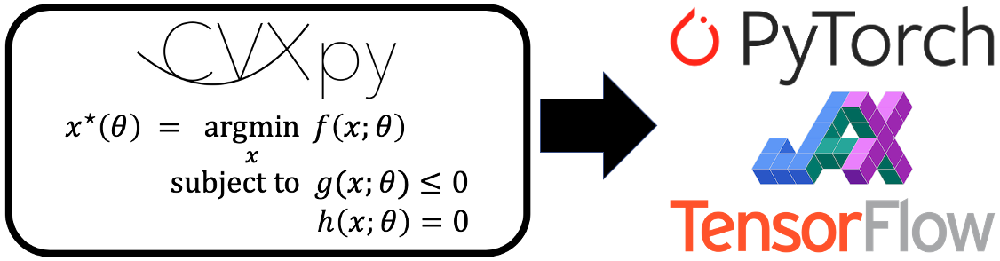

[](https://travis-ci.org/cvxgrp/cvxpylayers)
[](https://ci.appveyor.com/project/sbarratt/cvxpylayers/branch/master)

# cvxpylayers

cvxpylayers is a Python library for constructing differentiable convex
optimization layers in PyTorch, JAX, and TensorFlow using CVXPY.
A convex optimization layer solves a parametrized convex optimization problem
in the forward pass to produce a solution.
It computes the derivative of the solution with respect to
the parameters in the backward pass.

This library accompanies our [NeurIPS 2019 paper](https://web.stanford.edu/~boyd/papers/pdf/diff_cvxpy.pdf)
on differentiable convex optimization layers.
For an informal introduction to convex optimization layers, see our
[blog post](https://locuslab.github.io/2019-10-28-cvxpylayers/).

Our package uses [CVXPY](https://github.com/cvxgrp/cvxpy) for specifying
parametrized convex optimization problems.

- [Installation](#installation)
- [Usage](#usage)
- [Examples](#examples)
- [Contributing](#contributing)
- [Projects using cvxpylayers](#projects-using-cvxpylayers)
- [License](#contributing)
- [Citing](#citing)

## Installation

Use the package manager [pip](https://pip.pypa.io/en/stable/) to install
cvxpylayers.

```bash
pip install cvxpylayers
```

Our package includes convex optimization layers for
PyTorch, JAX, and TensorFlow 2.0;
the layers are functionally equivalent. You will need to install
[PyTorch](https://pytorch.org),
[JAX](https://github.com/google/jax), or
[TensorFlow](https://www.tensorflow.org)
separately, which can be done by following the instructions on their websites.

cvxpylayers has the following dependencies:
* Python 3
* [NumPy](https://pypi.org/project/numpy/)
* [CVXPY](https://github.com/cvxgrp/cvxpy) >= 1.1.a4
* [PyTorch](https://pytorch.org) >= 1.0, [JAX](https://github.com/google/jax) >= 0.2.12, or [TensorFlow](https://tensorflow.org) >= 2.0
* [diffcp](https://github.com/cvxgrp/diffcp) >= 1.0.13

## Usage
Below are usage examples of our PyTorch, JAX, and TensorFlow layers.
Note that the parametrized convex optimization problems must be constructed
in CVXPY, using
[DPP](https://www.cvxpy.org/tutorial/advanced/index.html#disciplined-parametrized-programming).

### PyTorch

```python
import cvxpy as cp
import torch
from cvxpylayers.torch import CvxpyLayer

n, m = 2, 3
x = cp.Variable(n)
A = cp.Parameter((m, n))
b = cp.Parameter(m)
constraints = [x >= 0]
objective = cp.Minimize(0.5 * cp.pnorm(A @ x - b, p=1))
problem = cp.Problem(objective, constraints)
assert problem.is_dpp()

cvxpylayer = CvxpyLayer(problem, parameters=[A, b], variables=[x])
A_tch = torch.randn(m, n, requires_grad=True)
b_tch = torch.randn(m, requires_grad=True)

# solve the problem
solution, = cvxpylayer(A_tch, b_tch)

# compute the gradient of the sum of the solution with respect to A, b
solution.sum().backward()
```

Note: `CvxpyLayer` cannot be traced with `torch.jit`.

### JAX
```python
import cvxpy as cp
import jax
from cvxpylayers.jax import CvxpyLayer

n, m = 2, 3
x = cp.Variable(n)
A = cp.Parameter((m, n))
b = cp.Parameter(m)
constraints = [x >= 0]
objective = cp.Minimize(0.5 * cp.pnorm(A @ x - b, p=1))
problem = cp.Problem(objective, constraints)
assert problem.is_dpp()

cvxpylayer = CvxpyLayer(problem, parameters=[A, b], variables=[x])
key = jax.random.PRNGKey(0)
key, k1, k2 = jax.random.split(key, 3)
A_jax = jax.random.normal(k1, shape=(m, n))
b_jax = jax.random.normal(k2, shape=(m,))

solution, = cvxpylayer(A_jax, b_jax)

# compute the gradient of the summed solution with respect to A, b
dcvxpylayer = jax.grad(lambda A, b: sum(cvxpylayer(A, b)[0]), argnums=[0, 1])
gradA, gradb = dcvxpylayer(A_jax, b_jax)
```

Note: `CvxpyLayer` cannot be traced with the JAX `jit` or `vmap` operations.

### TensorFlow 2
```python
import cvxpy as cp
import tensorflow as tf
from cvxpylayers.tensorflow import CvxpyLayer

n, m = 2, 3
x = cp.Variable(n)
A = cp.Parameter((m, n))
b = cp.Parameter(m)
constraints = [x >= 0]
objective = cp.Minimize(0.5 * cp.pnorm(A @ x - b, p=1))
problem = cp.Problem(objective, constraints)
assert problem.is_dpp()

cvxpylayer = CvxpyLayer(problem, parameters=[A, b], variables=[x])
A_tf = tf.Variable(tf.random.normal((m, n)))
b_tf = tf.Variable(tf.random.normal((m,)))

with tf.GradientTape() as tape:
  # solve the problem, setting the values of A, b to A_tf, b_tf
  solution, = cvxpylayer(A_tf, b_tf)
  summed_solution = tf.math.reduce_sum(solution)
# compute the gradient of the summed solution with respect to A, b
gradA, gradb = tape.gradient(summed_solution, [A_tf, b_tf])
```

Note: `CvxpyLayer` cannot be traced with `tf.function`.

### Log-log convex programs
Starting with version 0.1.3, cvxpylayers can also differentiate through log-log convex programs (LLCPs), which generalize geometric programs. Use the keyword argument `gp=True` when constructing a `CvxpyLayer` for an LLCP. Below is a simple usage example

```python
import cvxpy as cp
import torch
from cvxpylayers.torch import CvxpyLayer

x = cp.Variable(pos=True)
y = cp.Variable(pos=True)
z = cp.Variable(pos=True)

a = cp.Parameter(pos=True, value=2.)
b = cp.Parameter(pos=True, value=1.)
c = cp.Parameter(value=0.5)

objective_fn = 1/(x*y*z)
objective = cp.Minimize(objective_fn)
constraints = [a*(x*y + x*z + y*z) <= b, x >= y**c]
problem = cp.Problem(objective, constraints)
assert problem.is_dgp(dpp=True)

layer = CvxpyLayer(problem, parameters=[a, b, c],
                   variables=[x, y, z], gp=True)
a_tch = torch.tensor(a.value, requires_grad=True)
b_tch = torch.tensor(b.value, requires_grad=True)
c_tch = torch.tensor(c.value, requires_grad=True)

x_star, y_star, z_star = layer(a_tch, b_tch, c_tch)
sum_of_solution = x_star + y_star + z_star
sum_of_solution.backward()
```

## Solvers

At this time, we support two open-source solvers: [SCS](https://github.com/cvxgrp/scs) and [ECOS](https://github.com/embotech/ecos).
SCS can be used to solve any problem expressible in CVXPY; ECOS can be used to solve problems that don't use
the positive semidefinite or exponential cone (this roughly means that if you have positive semidefinite matrices
or use atoms like `cp.log`, ECOS cannot be used to solve your problem via `cvxpylayers`).
By default, `cvxpylayers` uses SCS to solve the problem.

### Using ECOS
First make sure that you have `cvxpylayers` and `diffcp` up to date,
by running
```
pip install --upgrade cvxpylayers diffcp
```
Then, to use ECOS, you would pass the `solver_args` argument to the layer:
```
solution = layer(*params, solver_args={"solve_method": "ECOS"})
```

### Passing arguments to the solvers
One can pass arguments to both SCS and ECOS by adding the argument as a key-value pair
in the `solver_args` argument.
For example, to increase the tolerance of SCS to `1e-8` one would write:
```
layer(*parameters, solver_args={"eps": 1e-8})
```
If SCS is not converging, we highly recommend switching to ECOS (if possible),
and if not, using the following arguments to `SCS`:
```
solver_args={"eps": 1e-8, "max_iters": 10000, "acceleration_lookback": 0}
``` 

## Examples
Our [examples](examples) subdirectory contains simple applications of convex optimization
layers in IPython notebooks.

## Contributing
Pull requests are welcome. For major changes, please open an issue first to
discuss what you would like to change.

Please make sure to update tests as appropriate.

Please lint the code with `flake8`.
```bash
pip install flake8  # if not already installed
flake8
```

### Running tests

cvxpylayers uses the `pytest` framework for running tests.
To install `pytest`, run:
```bash
pip install pytest
```

Execute the tests from the main directory of this repository with:
```bash
pytest cvxpylayers/{torch,jax,tensorflow}
```

## Projects using cvxpylayers
Below is  a list of projects using cvxpylayers. If you have used cvxpylayers in a project, you're welcome to make a PR to add it to this list.
* [Learning Convex Optimization Control Policies](https://web.stanford.edu/~boyd/papers/learning_cocps.html)
* [Learning Convex Optimization Models](https://web.stanford.edu/~boyd/papers/learning_copt_models.html)

## License
cvxpylayers carries an Apache 2.0 license.

## Citing
If you use cvxpylayers for research, please cite our accompanying [NeurIPS paper](https://web.stanford.edu/~boyd/papers/pdf/diff_cvxpy.pdf):

```
@inproceedings{cvxpylayers2019,
  author={Agrawal, A. and Amos, B. and Barratt, S. and Boyd, S. and Diamond, S. and Kolter, Z.},
  title={Differentiable Convex Optimization Layers},
  booktitle={Advances in Neural Information Processing Systems},
  year={2019},
}
```

If you use cvxpylayers to differentiate through a log-log convex program, please cite the accompanying [paper](https://web.stanford.edu/~boyd/papers/diff_dgp.html):

```
@article{agrawal2020differentiating,
  title={Differentiating through log-log convex programs},
  author={Agrawal, Akshay and Boyd, Stephen},
  journal={arXiv},
  archivePrefix={arXiv},
  eprint={2004.12553},
  primaryClass={math.OC},
  year={2020},
}
```
